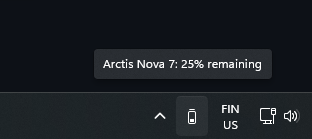

# Arctis Battery Indicator

Adds a small icon to the "system tray" area of the Windows task bar, which displays the battery level of any connected SteelSeries Arctis headset.

## Features

* Works on Windows 10+
* Built using Rust, with very low resource usage (<1MB RAM)
* Supports all known Arctis headsets

## Installation

* Download the [latest release](https://github.com/aarol/arctis-battery-indicator/releases/latest) .zip file
* Extract all of the files into any folder (like Downloads).
* Right click `Install.ps1` and run the PowerShell script.

You can also update the program by downloading a new version and running `Install.ps1`.

## How to uninstall

Simply remove all of the files in `%localAppData%\ArctisBatteryIndicator` (copy the path, press Win+R and paste the path to enter)

The installer also creates a file in `%appData%\Microsoft\Windows\Start Menu\Programs\Startup` to run the program on startup.

## Troubleshooting

If you're experiencing crashes or other issues, you can try running the `arctis-battery-indicator-debug.exe` located at `%localAppData%\ArctisBatteryIndicator` or look at the log file located in the same folder.

### Why does it only show 100%, 75%, 50%, 25% or 0%?

This is limitation of the headsets themselves, as the devices only expose 5 possible battery states.

### My headset is connected, but it still shows "No headphone adapter found"

Your headset might be unsupported due to being a newer model. Either [create a new issue](https://github.com/aarol/arctis-battery-indicator/issues/new) or see [Adding a new headset](#adding-a-new-headset)

### Connection status updates slowly / unreliably

Often the adapter (plugged into your PC) is *really slow* at updating its information whenever something happens, like headphones disconnecting / reconnecting. I haven't found a way to work around this yet. Shutting down the SteelSeries GG app *may* help on some occasions.

## Development

Rust and Cargo need to be installed.

* Running the application: `cargo run --release`

* Installing the application locally: `cargo install`

* Debugging the application: press `F5` in VS Code with the Rust Analyzer extension and CodeLLDB installed.

## Todo

* Updated icons to show charging states, etc.
* Add better installation experience.

## Adding a new headset

Add a new entry to the bottom of `KNOWN_HEADPHONES` in [headphone_models.rs](src/headphone_models.rs) and submit a new pull request.

The parameters, such as `write_bytes` and `battery_percent_idx` can be discovered by sniffing the USB traffic with something like [WireShark](https://www.wireshark.org/) and [USBPcap](https://desowin.org/usbpcap/)

I have a post on my website explaining how to do this: <https://aarol.dev/posts/arctis-hid>
