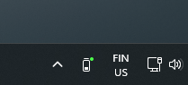

# Arctis Battery Indicator

Adds a small icon to the "system tray" area of the Windows task bar, which displays the battery level of any connected SteelSeries Arctis headset.


## Features

* Works on Windows 10+
* Built using Rust, with very low resource usage (<1MB RAM)
* Supports all known Arctis headsets
* Shows a little green dot to indicate charging

  

## Installation

* Download the [latest release](https://github.com/aarol/arctis-battery-indicator/releases/latest) and run the installer

> Running the installer may result in a Windows defender SmartScreen warning. This happens to all executables that don't have a large enough install count. There's no way around it other than paying hundreds of dollars every year for a signed certificate from Microsoft :(

## Safety

The code that is in this repository is the code that is in the executable. There is a [Github Action](https://github.com/aarol/arctis-battery-indicator/actions) that builds the code from source and creates the installer.

There is no user-friendly way to verify that the .exe file is unmodified by me or anyone else, but if you have a Github account and the [Github Cli](https://cli.github.com/) installed, you can run

```sh
gh attestation verify '.\ArctisBatteryIndicatorSetup.exe' --owner aarol
```

Which cryptographically verifies that the file is unmodified from the one built by the Github Action.

## Troubleshooting

If you're experiencing crashes or other issues, you can try running the `arctis-battery-indicator-debug.exe` located at `%localAppData%\Programs\ArctisBatteryIndicator` or look at the log file located in the same folder.

### Why does it only show 100%, 75%, 50%, 25% or 0%?

This is limitation of the headsets themselves, as most devices only expose 5 possible battery states.

### My headset is connected, but it still shows "No headphone adapter found"

Your headset might be unsupported due to being a newer model. Either [create a new issue](https://github.com/aarol/arctis-battery-indicator/issues/new) or see [Adding a new headset](#adding-a-new-headset)

## Development

Rust and Cargo need to be installed.

* Running the application: `cargo run --release`

* Installing the application locally: `cargo install`

* Debugging the application: press `F5` in VS Code with the Rust Analyzer extension and CodeLLDB installed.

### Translations

Translations can be added to the [lang.rs](./src/lang.rs) file.

## Todo

* Updated icons to show charging states, etc.

## Adding a new headset

I have a post on my website explaining that tries to explain how to do this: <https://aarol.dev/posts/arctis-hid>

The parameters, such as `write_bytes` and `battery_percent_idx` can be discovered by sniffing the USB traffic with something like [WireShark](https://www.wireshark.org/) and [USBPcap](https://desowin.org/usbpcap/)

Also see example [config.toml](./example.config.toml) for more documentation.

If you have found the necessary data, you can try it out by creating a custom config file:

1. Install version 2.0.0 or greater of Arctis Battery Indicator
2. Navigate to the program data folder (that would be `%localAppData%\Programs\ArctisBatteryIndicator` by default)
3. Rename the `example.config.toml` file to `config.toml`
4. Update the data in the `config.toml` file (most headphones have similar configurations, you can look at [this file](./src/headphone_models.rs) for inspiration)
5. Launch the `arctis-battery-indicator-debug.exe` in the same directory to test your changes. It should say "Found custom config" in the logs.

Reading the [HeadsetControl wiki](https://github.com/Sapd/HeadsetControl/wiki/Development#problems) might be helpful for troubleshooting.

If you have a working configuration file, you should create a [new issue](https://github.com/aarol/arctis-battery-indicator/issues/new) with the file contents, so that everyone else can benefit from it too!
